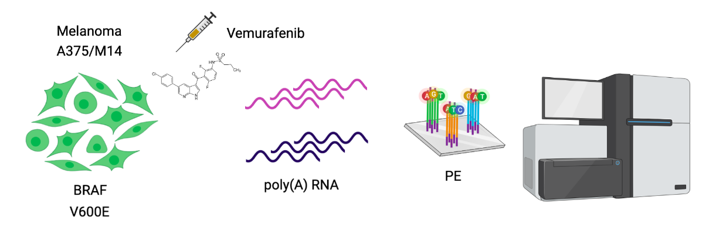
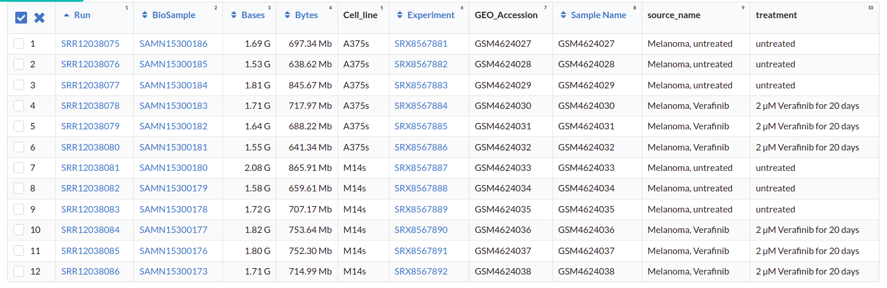
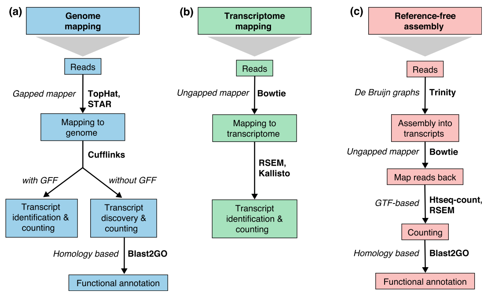
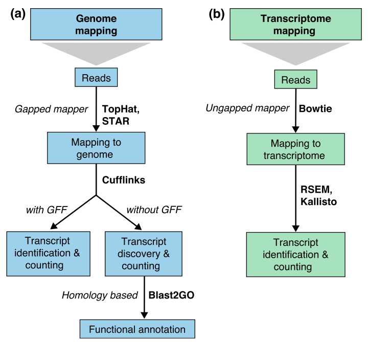

```{r xaringan-themer, include=FALSE, warning=FALSE}
#install.packages("xaringanthemer")
library(xaringanthemer)
style_mono_accent(
  base_color = "#43418A",
  header_font_google = google_font("Fredoka","300"),
  text_font_google   = google_font("Montserrat", "300", "300i"),
  code_font_google   = google_font("Fira Mono")
)
#style_extra_css(css = extra_css, outfile = "extra.css")
```

# Día 1

**Agenda:**

- Presentaciones y Lluvia de Ideas

- Overview RNA-seq
- Aspectos generales del Pre-Análisis
  - Diseño Experimental
  - Diseño de secuenciación
  
- Pipeline bioinformática
  - Quality Check
  - Trimming

- Ejercicio QC

---

# RNA-seq, ¿qué pensamos?

.scrollable[

**Actividad:** Lluvia de ideas


- Llenen en la siguiente tabla palabras clave sobre RNA-seq: https://docs.google.com/document/d/1pAFddzDlLrRvHMSUjddh7EG3PdTbob3g9UQWzMHXR-w/edit?usp=sharing

- Generemos una [figura de nuestras ideas](https://www.r-graph-gallery.com/wordcloud.html):

```{bash, echo=FALSE, eval=FALSE}
cat palabras | perl -pe 's/\s/","/g'
```


```{r, warning=FALSE, echo=TRUE}
library(wordcloud)
library(RColorBrewer)

words <- c("Librería,","Secuenciación,","Transcripción,","samtools,","RNA,","","Regulación,","Nucleótido,","Traducción","RNA,","secuenciación,","proteínas,","regulación,","expresión","génica","Secuenciación,","expresión","diferencial,","transcriptoma,","fenotipos","exones","Transcriptoma,","expresión","diferencial,","RNA,","diferencia","celular","Transcripción,","regulación,","expresión,","muestra","Expresion,","exones,","transcriptoma,","UTR,","hisat2,","splicing,","Transcritoma,","splicing,","cDNA")

wordcloud(words, colors = RColorBrewer::brewer.pal(5,name = "BuPu"))
```

]

---

# Transcriptómica

Estudio del **transcriptoma** - el set completo de transcritos de RNA producidos por el genoma bajo **condiciones específicas** o en una **célula específica** - usando métodos _high-throughput_.

- Identidad y abundancia

.container[
 [4]
]

???

o de alto rendimiento

- **¿Por qué la obsesión en el RNA?** Es un intermediario escencial entre el genoma y el proteoma. Entre lo pre-programado y la interacción con el ambiente. 

---

# ¿Qué es el RNA- seq?


[4]

???

Herramienta que hace uso de las tecnologías de secuenciación NGS para generar perfiles transcriptómicos.

---

# Aplicaciones

 [5]

???

Responder preguntas biológicas

---

# Bases de Datos

**Datos de publicación**

- NCBI
  - [Gene Expression Omnibus (GEO)](https://www.ncbi.nlm.nih.gov/geo/browse/)
  - Sequence Read Archive (SRA)
  
- EMBL-EBI
  - [ArrayExpress](https://www.ebi.ac.uk/arrayexpress/about.html)
  
**Consorcios **
  
- [Genotype Tissue-Expression (GTEx)](https://gtexportal.org/home/tissueSummaryPage)

- [The Cancer Genome Atlas (TCGA)](https://portal.gdc.cancer.gov/)

**Integración de datos para análisis**

- [recount3](https://rna.recount.bio/)

- [pulmonDB](https://pulmondb.liigh.unam.mx/)

---

# Aspectos generales del Pre Análisis

### Diseño Experimental y Diseño de Secuenciación

 [1]

---

## Protocolo de extracción de RNA

**Propósito:** 
  
  Deshacerse del RNA ribosomal (90%) y quedarse con el mRNA (~1-2%)

.pull-left[
    
 - Eukaryotes
    - Enriquecer mRNAs usando selección de poly(A)
        - Degradación mínima del RNA, medido por _RNA Integrity Number (RIN)_

- Prokaryotes o _bad RIN_
    - Deshacerse del rRNA]
    
.pull-right[


]
    
---

### RNA world

- **lncRNA & mRNA**: polyA selection

- **miRNA** : binding of 3'UTR target genes

- **sncRNA (miRNAs, piRNAs, and endosiRNAs)** : captured by direct ligation with adapters

- **circular RNA**: uso de exonuclease R para digerir RNA lineal

---

## Library Type

**La mejor opción:** depende del propósito del análisis

.pull-left[
- Single-end (SE)
    - Organismo bien documentado
    - Bajo costo
    
- Paired-end (PE) reads
    - Descubrimiento de transcritos _de novo_ 
    - Análisis de expresión de isoformas
    - Organismo no anotado
]

.pull-right[    
.fit[
 [2]
]]

---

## Sequencing Depth ó Library Size

`Número de secuenciación de lecturas para una muestra dada.`


**Mejor opción:** depende

- 5 millones de lecturas --> Cuantificación adecuada de genes altamente expresados 

- 100 millones de lecturas --> genes con niveles de expresión bajos

En general: 
`+ sequencing depth = + transcritos + precisión`
  
- Detección de ruido transcripcional

???

curvas de saturacion 

---

## Número de replicas

Depende de la variabilidad técnica y la variabilidad biológica del objeto de estudio, así como del poder estadístico deseado.

.pull-left[
- Variabilidad en mediciones
    - extracción o _library prep_
- Variabilidad biológica
    - Inferencias poblacionales: minimo 3
- Poder estadístico
    - Depende del método]

.pull-right[.fit[

[1]
]]

---

# Diseño de Secuenciación

**Propósito:** Evitar introducir sesgos técnicos o factores de confusión en nuestras muestras.


> Nuestro experimento de RNA-seq es grande y las muestras deben de ser procesadas en multiples _batches_ o rondas de secuenciación de Illumina

**Aleatorización de muestras**

- Durante preparación de librería
- Rondas de secuenciación

> Muestras individualmente _barcoded_ y se requiren multiples _lanes_ de Illumina para _sequencing depth_ de nuestra elección

- Incluir todas las muestras en cada línea para minimizar el _lane effect_

???

- _spike-ins_ o transcritos exógenos de referencia
    - QC y normalización

---

# Pipeline bioinformática

.pull-left[
.container[
]
]

.pull-right[
[4]]
---

# Quality Check

Some tools:

- `FASTQC` Illumina reads
- `NGSQC` any platform
- `multiqc` : genera reportes gráficos con múltiples muestras

Revisar:

- Read quality decreases towards the 3' end of reads
- Niveles de k-meros, lecturas duplicadas, contenido de GC son experimento y organismo específicos pero deben ser homogeneos

---

# Trimming

Some tools: `FASTX-Toolkit`, `Trimmomatic`, `cutadapat`

Funciones:

- Quitar lecturas con mala calidad
- Quitar bases con baja calidad
- Cortar secuencias de adaptadores


---

# Ejercicio QC


---

# References

- [1] Conesa, A., Madrigal, P., Tarazona, S., … Mou, S. (2017). RNA-seq methods. Journal of Cellular Biochemistry, 8(1), 1–24. https://doi.org/10.1002/wrna.1364.RNA-Seq

- [2] Hrdlickova, R., Toloue, M., & Tian, B. (2017). RNA‐Seq methods for transcriptome analysis. Wiley Interdisciplinary Reviews: RNA, 8(1), e1364.

- [3] Stark, R., Grzelak, M., & Hadfield, J. (2019). RNA sequencing: the teenage years. Nature Reviews Genetics, 20(11), 631-656.

- [4] Villaseñor-Altamirano, A. B. & Chávez-Domínguez, R. L. "Mini curso abril 2021: Panorama general de análisis de datos de RNA-seq con R". Red Mexicana de Bioinformática (2021). https://comunidadbioinfo.github.io/minicurso_abr_2021/

- [5] Created with BioRender.com

---

# Día 2

.scrollable[

**Agenda:**

- Caso de estudio, pipeline so far, revisión QC

- In-depth Pipeline bioinformática
  - Alineamiento, Pseudoalineamiento y Conteo
  - Visualizacion de reads en IGV
  - Algoritmos de programas famosos
  - Ejercicio: pseudo-alineamiento con `kallisto`

]

??

¿Cómo tengo certeza de que mi gen no es un artefacto?

---

# Caso de estudio: BRAF inhibition in melanoma cell lines

.scrollable[
Número de acceso GEO: [GSE152699](https://www.ncbi.nlm.nih.gov/geo/query/acc.cgi?acc=GSE152699)



_image from (Villaseñor-Altamirano AB, 2021)_

[SRA Run Selector: SRP267712](https://www.ncbi.nlm.nih.gov/Traces/study/?acc=PRJNA640146&o=acc_s%3Aa) :



.red[Nota:] Notemos que cada una de las runs o tandas de secuenciación (identificadas con `SRR`), corresponden a una muestra biológica o réplica (identificadas con `SAMN`).

.
.
.
.

]

---

# Pipeline so far

.scrollable[
```{bash, eval=FALSE}
screen -S data
qlogin
umask 2 # permisos
cd mpadilla/clases/rnaseq # change to yours
```

- Obtener archivos fastq

```{bash, eval=FALSE}
module load e-utilities/27abr20
module load sra/2.9.6-1
vdb-config -i # disable storage of cache in ~
mkdir -p data/fastq
```

That opens an interface, press `2` (disable local file caching) > `6` (save) > `7` (exit).

```{bash, eval=FALSE}
# Get SRR accessions, then download fastq files
esearch -db sra -query "SRP267712" |  efetch -format docsum | xtract -pattern Runs -ACC @acc  -element "&ACC" | xargs fastq-dump --outdir ./data/fastq --gzip --split-3
mv *.fastq.gz data/fastq # move fastq files to their dir
```

- QC

current dir = `[mpadilla/clases/rnaseq]`

```{bash, eval=FALSE}
module load fastqc/0.11.3
fastqc ./data/fastq/*.fastq.gz -o ./out/QC
```


- Trimming

Correr iterativamente trimmomatic

```{bash, eval=FALSE}
mkdir out/trimmed
cd out/trimmed
module load trimmomatic/0.33
for file in ../../data/fastq/*1.fastq.gz; do trimmomatic PE -phred33 -basein $file -baseout ${file//_1.fastq/_trmd_1.fastq} ILLUMINACLIP:/mnt/Citosina/amedina/mpadilla/resources/trimmomatic/adapters/TruSeq3-PE.fa:2:30:10 SLIDINGWINDOW:5:30 MINLEN:40; done
cd ../..
```

Adapters file downloaded from: https://github.com/timflutre/trimmomatic/blob/master/adapters/TruSeq3-PE.fa, [HiSeq uses TruSeq3 adapters as indicated in trimmomatic manual](http://www.usadellab.org/cms/uploads/supplementary/Trimmomatic/TrimmomaticManual_V0.32.pdf).

- QC

```{bash, eval=FALSE}
mkdir out/QC2
fastqc ./out/trimmed/*.fastq.gz -o ./out/QC2
```

- Reporte multiqc

```{bash, eval=FALSE}
module load multiqc/1.5
multiQC ./out/QC2
pwd
```

- See file

In local:

```{bash, eval=FALSE}
rsync -rptuvl mpadilla@dna.liigh.unam.mx:/mnt/Citosina/amedina/mpadilla/clases/rnaseq/out/QC2/multiqc_report.html . # descargar
xdg-open multiqc_report.html # abrir archivo
```


]

---

# Pipeline: Dónde estamos

.container[

]

---

# Alineamiento


---

# Alineamiento y Conteo

¿Cómo saber qué tipo de algoritmo usar?



---

# Alineamiento con referencia

.pull-left[

]

.pull-right[
- ¿Encontrar nuevos transcritos o sólo cuantificar?
  - PE y alta cobertura
  
- Mapeo singular o múltiple de lecturas
  - Secuencias repetidas en el genoma, genes paralogos
  - Mayor mapeo múltiple con transcriptoma debido a isoformas
]

---

### Genoma de referencia


_image from (Villaseñor-Altamirano AB, 2021)_

---

### Ejemplos genoma de referencia

_ _splicing aware__ : Hacen gaps en los reads al compara con el genoma de referencia

.container[
]

_image from (Villaseñor-Altamirano AB, 2021)_

---


---

### Ejemplo transcriptoma de referencia

Programa `kallisto`

- Precisos al caracterizar transcritos con alta abundancia, menos precisos con transcritos con menos o cortos

.fit[
]

---

# Ensamblaje de novo

.pull-left[
- Uso de PE o lecturas largas

- Balance en cobertura
    - Transcritos de baja expresión: unreliable
    - Mucha cobertura: potencial ensamblaje erróneo y mayor tiempo de ejecución
    
- Combinar reads de todas las muestras para el ensamblaje --> comparaciones adecuadas
]

.pull-right[
.container2[

]]

---

# Cuantificación de transcritos

.scrollable[
- Enfoque simple: número de reads que mapearon a cada secuencia
    - `HTSeq-count`, `featureCounts`
      - Gene-level => gene transfer format (GTF)
    - `Cufflinks`: PE, GTF o no, toma en cuenta sesgos de longitud de genes, distribución de reads

- `sailfish` : k-meros de reads

- ¿Cómo sé que mis cuentas corresponden a genes/transcritos?
  - Referencia con anotaciones
  - [GENCODE](https://www.gencodegenes.org/mouse/)
  - [Ensembl](https://www.ensembl.org/info/data/ftp/index.html)

`output` : **Cuentas crudas** o _raw counts_
¿Ya puedo comparar mis niveles de expresión en mi experimento?

]

---

# Ejercicio: 

.scrollable[
### Alineamiento y conteo usando [`kallisto`][kallisto]

.red[ Nota:] cualquier línea de código encerrada en `[]` es opcional o debe cambiarse para tus paths o caso especfíco.

Ir a mi directorio en el cluster:

```{bash, eval=FALSE}
ssh -Y mpadilla@[direccion]
cd [/path/a/mi/dir]/mpadilla/
# ir al directorio del proyecto o la clase
cd [clases/rnaseq/]
```


Descargar [transcriptoma de referencia de ratón de GENCODE](https://www.gencodegenes.org/mouse/):

```{bash, eval=FALSE}
mkdir resources; cd resources
wget https://ftp.ebi.ac.uk/pub/databases/gencode/Gencode_mouse/release_M28/gencode.vM28.transcripts.fa.gz
cd .. # regresar a rnaseq
```

Hacer índice del transcriptoma de referencia que hicimos con GENCODE:

- Ver ayuda en [manual de kallisto][kallisto] o en terminal ( `kallisto index -h` )

```{bash, eval=FALSE}
module load kallisto/0.45.0 # cargar modulo de kallisto
kallisto index -i index_kallisto45_gencode-m28s gencode.vM28.transcripts.fa.gz
cd .. # salimos del dir resources
```

* `-i` nombre de archivo de salida, i.e., indice

Hacer liga blanda a archivos fastq ya corregidos con trimming:

```{bash, eval=FALSE}
#ln -rs /mnt/Citosina/amedina/mpadilla/clases/rnaseq/out/trimmed [path/a/tu/dir/]out/
```

* .red[_Nota:_ ]en clase vimos que no podemos hacer esto si no tenemos permisos. Los datos se copiaron a `/mnt/Timina/bioinfoII/rnaseq/trimmed`

Hacer el conteo de transcritos ocupando el índice que hicimos:

```{bash, eval=FALSE}
mkdir out/kallisto # usar -p si no existe out aun
kallisto quant -i ./resources/index_kallisto45_gencode-m28 -o ./out/kallisto /mnt/Timina/bioinfoII/rnaseq/trimmed/* # once per sample!! #<<
```

* `-o` dir donde colocar output de kallisto

- .red[La última línea está mal!] Ahí le estamos diciendo a `kallisto quant` que haga la cuantificación de transcritos con TODOS los archivos fastq, i.e. de todas las muestras juntas, por lo que las cuentas de controles y casos (M14 con BRAF ihnibido o no) estarán combinadas y no podremos hacer comparaciones

Para correr `kallisto quant` POR muestra (`SAMN`, recordemos que en este caso cada run `SRR*.fastq` corresponde a una muestra), hagamos lo siguiente:

```{bash, eval=FALSE}
cd out/kallisto
# 1. Hacer dirs de salida para kallisto por muestra:
ls ../trimmed/ | perl -pe 's/(SRR\d+)_trmd.*/mkdir $1/' | uniq # copiar texto y pegar en terminal
```

```
mkdir SRR12038081
mkdir SRR12038082
mkdir SRR12038083
mkdir SRR12038084
mkdir SRR12038085
mkdir SRR12038086
```

* `ls ../trimmed/` : vemos archivos fastq, identificados por SRR
* `perl -pe 's/[match]/[substitution]/'` : con este formato llamamos a perl, `-pe` le dice que corra el siguiente código tomando como input cada línea del STDIN, `s/[match]/[substitution]/` denotamos una subtitución usando expresiones regulares, `(SRR\d+)_trmd.*` guardamos los ids con `()` y seleccionamos el resto, substituimos el texto por `mkdir $1` donde $1 es la variable que guardamos

```{bash, eval=FALSE}
# 2. Generar lineas para correr kallisto por muestra, ocupando el id SRR como identificador de archivos fastq y dirs
ls | grep "SRR" | perl -pe 's/(SRR\d+)/kallisto quant -i ..\/..\/resources\/index_kallisto45_gencode-m28 -o .\/$1 ..\/trimmed\/$1* /' 
# cambiar archivo en -i por el path a tu indice
```

```
kallisto quant -i ../../resources/index_kallisto45_gencode-m28 -o ./SRR12038081 ../trimmed/SRR12038081* 
kallisto quant -i ../../resources/index_kallisto45_gencode-m28 -o ./SRR12038082 ../trimmed/SRR12038082* 
kallisto quant -i ../../resources/index_kallisto45_gencode-m28 -o ./SRR12038083 ../trimmed/SRR12038083* 
kallisto quant -i ../../resources/index_kallisto45_gencode-m28 -o ./SRR12038084 ../trimmed/SRR12038084* 
kallisto quant -i ../../resources/index_kallisto45_gencode-m28 -o ./SRR12038085 ../trimmed/SRR12038085* 
kallisto quant -i ../../resources/index_kallisto45_gencode-m28 -o ./SRR12038086 ../trimmed/SRR12038086*
```

* `grep` selecciona lineas de STDIN o texto que hagan match 
* con perl escribimos las lineas para correr kallisto usando el string de las SRR ids al que hicimos match
* `../trimmed/SRR12038081*` esta parte tomará las reads a las que hicimos trimmming; como los datos provienen de PAIRED END, son un fastq por cada end (`SRR_trmd_1.fastq` y `SRR_trmd_2.fastq`).

_Nota:_ Otra manera de lidear con múltiples archivos, que generen múltiples archivos de salida y que necesitamos para correr en una pipeline es usando `snakemake` o `makefiles` en `bash`

Pegar ese output siguiente al sge (`[quant.sge]`) y hacer `qsub quant.sge`

```{bash, eval=FALSE}
#!/bin/bash
# Use current working directory
#$ -cwd
#
# Join stdout and stderr
#$ -j y
#
# Run job through bash shell
#$ -S /bin/bash
#
#You can edit the scriptsince this line
#   
# Your job name
#$ -N [quant] # cambiar #<<
#
# Send an email after the job has finished
#$ -m e
#$ -M [yourmail] #<<
#
#
# If modules are needed, source modules environment (Do not delete the next line):
. /etc/profile.d/modules.sh
#
# Add any modules you might require:
module load kallisto/0.45.0 #<<
#
# Write your commands in the next line
kallisto quant -i index_kallisto45_gencode-m28 -o ./SRR12038081 ../trimmed/SRR12038081* 
kallisto quant -i index_kallisto45_gencode-m28 -o ./SRR12038082 ../trimmed/SRR12038082* 
kallisto quant -i index_kallisto45_gencode-m28 -o ./SRR12038083 ../trimmed/SRR12038083* 
kallisto quant -i index_kallisto45_gencode-m28 -o ./SRR12038084 ../trimmed/SRR12038084* 
kallisto quant -i index_kallisto45_gencode-m28 -o ./SRR12038085 ../trimmed/SRR12038085* 
kallisto quant -i index_kallisto45_gencode-m28 -o ./SRR12038086 ../trimmed/SRR12038086*
```


]

---


---

#

---

# Normalización

- Las cuentras crudas no son adecuadas para comparar entre muestras
  - Gene/transcript length
  - Número total de reads
  - Sesgos de secuenciación
  
- Normalización _within-sample_
  - Tamaño de librería: Número de secuenciación de lecturas para una muestra dada


[kallisto]:https://pachterlab.github.io/kallisto/manual