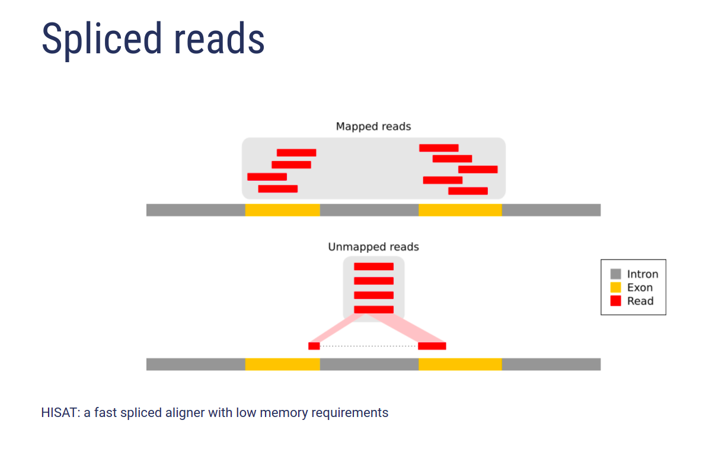
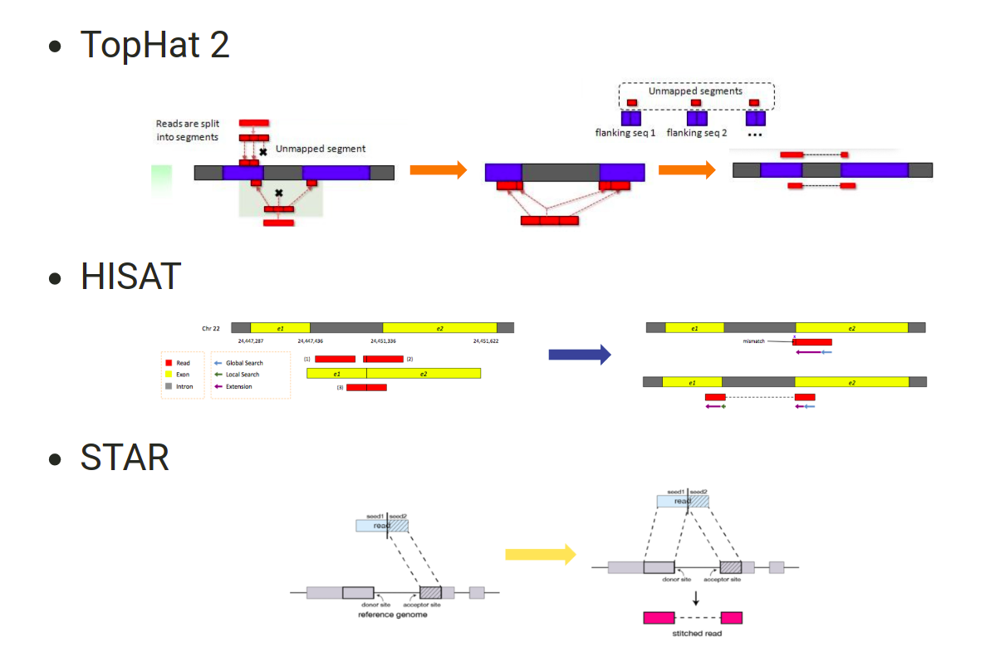
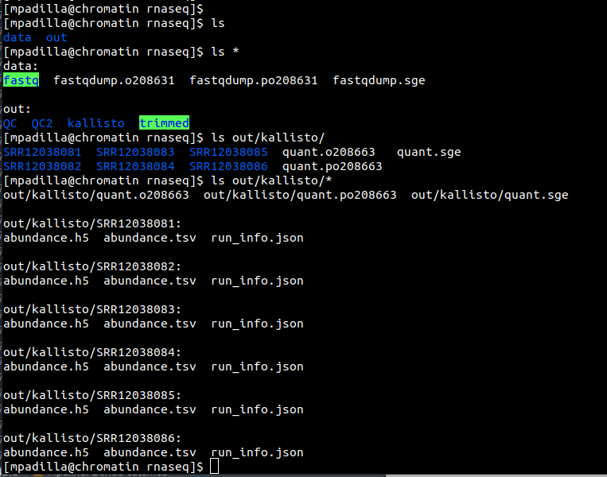
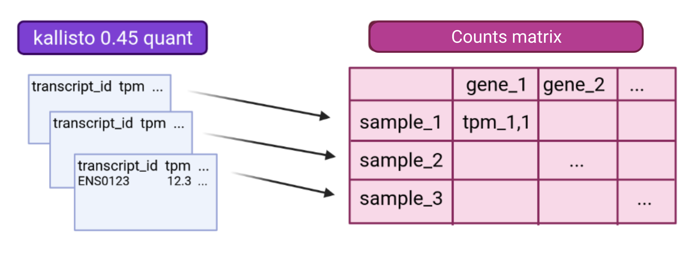
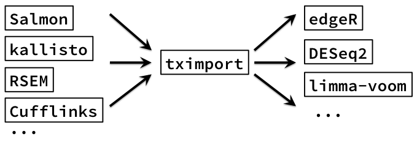
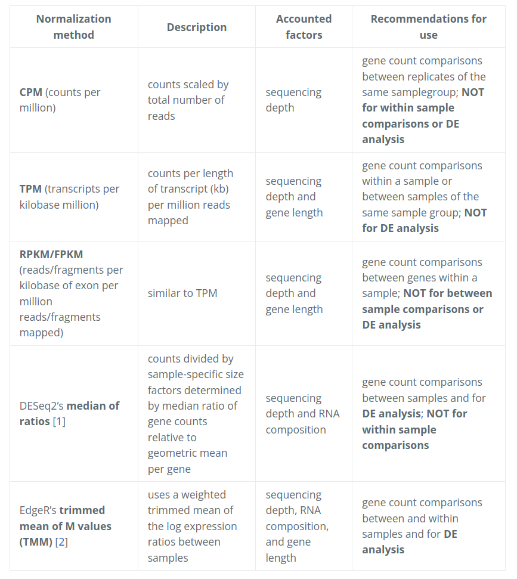
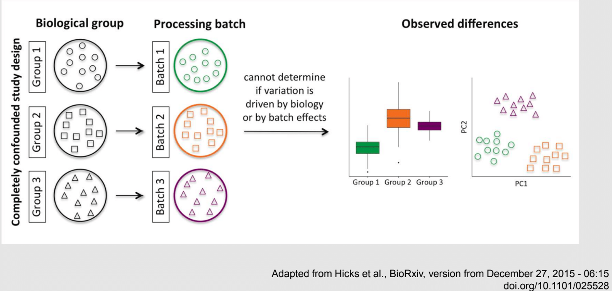
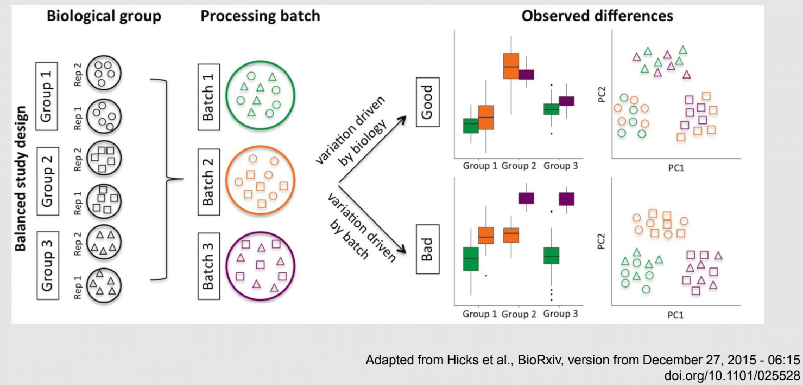
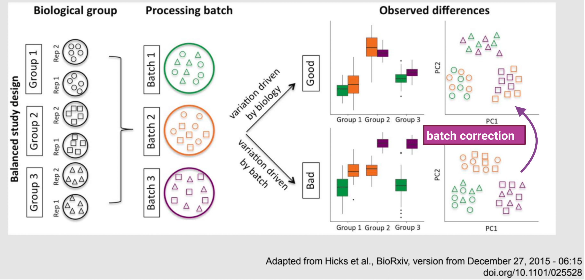
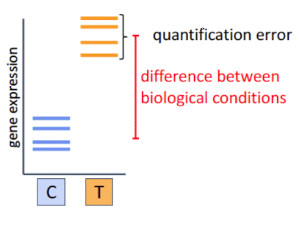

```{r xaringan-themer, include=FALSE, warning=FALSE}
#install.packages("xaringanthemer")
library(xaringanthemer)
style_mono_accent(
  base_color = "#43418A",
  header_font_google = google_font("Fredoka","300"),
  text_font_google   = google_font("Montserrat", "300", "300i"),
  code_font_google   = google_font("Fira Mono")
)
#style_extra_css(css = extra_css, outfile = "extra.css")
```

# Día 1

**Agenda:**

- Presentaciones y Lluvia de Ideas

- Overview RNA-seq
- Aspectos generales del Pre-Análisis
  - Diseño Experimental
  - Diseño de secuenciación
  
- Pipeline bioinformática
  - Quality Check
  - Trimming

- Ejercicio QC

---

# RNA-seq, ¿qué pensamos?

.scrollable[

**Actividad:** Lluvia de ideas


- Llenen en la siguiente tabla palabras clave sobre RNA-seq: https://docs.google.com/document/d/1pAFddzDlLrRvHMSUjddh7EG3PdTbob3g9UQWzMHXR-w/edit?usp=sharing

- Generemos una [figura de nuestras ideas](https://www.r-graph-gallery.com/wordcloud.html):

```{bash, echo=FALSE, eval=FALSE}
cat palabras | perl -pe 's/\s/","/g'
```


```{r, warning=FALSE, echo=TRUE}
library(wordcloud)
library(RColorBrewer)

words <- c("Librería,","Secuenciación,","Transcripción,","samtools,","RNA,","","Regulación,","Nucleótido,","Traducción","RNA,","secuenciación,","proteínas,","regulación,","expresión","génica","Secuenciación,","expresión","diferencial,","transcriptoma,","fenotipos","exones","Transcriptoma,","expresión","diferencial,","RNA,","diferencia","celular","Transcripción,","regulación,","expresión,","muestra","Expresion,","exones,","transcriptoma,","UTR,","hisat2,","splicing,","Transcritoma,","splicing,","cDNA")

wordcloud(words, colors = RColorBrewer::brewer.pal(5,name = "BuPu"))
```

]

---

# Transcriptómica

Estudio del **transcriptoma** - el set completo de transcritos de RNA producidos por el genoma bajo **condiciones específicas** o en una **célula específica** - usando métodos _high-throughput_.

- Identidad y abundancia

.container[
 [4]
]

???

o de alto rendimiento

- **¿Por qué la obsesión en el RNA?** Es un intermediario escencial entre el genoma y el proteoma. Entre lo pre-programado y la interacción con el ambiente. 

---

# ¿Qué es el RNA- seq?


[4]

???

Herramienta que hace uso de las tecnologías de secuenciación NGS para generar perfiles transcriptómicos.

---

# Aplicaciones

 [5]

???

Responder preguntas biológicas

---

# Bases de Datos

**Datos de publicación**

- NCBI
  - [Gene Expression Omnibus (GEO)](https://www.ncbi.nlm.nih.gov/geo/browse/)
  - Sequence Read Archive (SRA)
  
- EMBL-EBI
  - [ArrayExpress](https://www.ebi.ac.uk/arrayexpress/about.html)
  
**Consorcios **
  
- [Genotype Tissue-Expression (GTEx)](https://gtexportal.org/home/tissueSummaryPage)

- [The Cancer Genome Atlas (TCGA)](https://portal.gdc.cancer.gov/)

**Integración de datos para análisis**

- [recount3](https://rna.recount.bio/)

- [pulmonDB](https://pulmondb.liigh.unam.mx/)

---

# Aspectos generales del Pre Análisis

### Diseño Experimental y Diseño de Secuenciación

 [1]

---

## Protocolo de extracción de RNA

**Propósito:** 
  
  Deshacerse del RNA ribosomal (90%) y quedarse con el mRNA (~1-2%)

.pull-left[
    
 - Eukaryotes
    - Enriquecer mRNAs usando selección de poly(A)
        - Degradación mínima del RNA, medido por _RNA Integrity Number (RIN)_

- Prokaryotes o _bad RIN_
    - Deshacerse del rRNA]
    
.pull-right[


]
    
---

### RNA world

- **lncRNA & mRNA**: polyA selection

- **miRNA** : binding of 3'UTR target genes

- **sncRNA (miRNAs, piRNAs, and endosiRNAs)** : captured by direct ligation with adapters

- **circular RNA**: uso de exonuclease R para digerir RNA lineal

---

## Library Type

**La mejor opción:** depende del propósito del análisis

.pull-left[
- Single-end (SE)
    - Organismo bien documentado
    - Bajo costo
    
- Paired-end (PE) reads
    - Descubrimiento de transcritos _de novo_ 
    - Análisis de expresión de isoformas
    - Organismo no anotado
]

.pull-right[    
.fit[
 [2]
]]

---

## Sequencing Depth ó Library Size

`Número de secuenciación de lecturas para una muestra dada.`


**Mejor opción:** depende

- 5 millones de lecturas --> Cuantificación adecuada de genes altamente expresados 

- 100 millones de lecturas --> genes con niveles de expresión bajos

En general: 
`+ sequencing depth = + transcritos + precisión`
  
- Detección de ruido transcripcional

???

curvas de saturacion 

---

## Número de replicas

Depende de la variabilidad técnica y la variabilidad biológica del objeto de estudio, así como del poder estadístico deseado.

.pull-left[
- Variabilidad en mediciones
    - extracción o _library prep_
- Variabilidad biológica
    - Inferencias poblacionales: minimo 3
- Poder estadístico
    - Depende del método]

.pull-right[.fit[

[1]
]]

---

# Diseño de Secuenciación

**Propósito:** Evitar introducir sesgos técnicos o factores de confusión en nuestras muestras.


> Nuestro experimento de RNA-seq es grande y las muestras deben de ser procesadas en multiples _batches_ o rondas de secuenciación de Illumina

**Aleatorización de muestras**

- Durante preparación de librería
- Rondas de secuenciación

> Muestras individualmente _barcoded_ y se requiren multiples _lanes_ de Illumina para _sequencing depth_ de nuestra elección

- Incluir todas las muestras en cada línea para minimizar el _lane effect_

???

- _spike-ins_ o transcritos exógenos de referencia
    - QC y normalización

---

# Pipeline bioinformática

.pull-left[
.container[
]
]

.pull-right[
[4]]
---

# Quality Check

Some tools:

- `FASTQC` Illumina reads
- `NGSQC` any platform
- `multiqc` : genera reportes gráficos con múltiples muestras

Revisar:

- Read quality decreases towards the 3' end of reads
- Niveles de k-meros, lecturas duplicadas, contenido de GC son experimento y organismo específicos pero deben ser homogeneos

---

# Trimming

Some tools: `FASTX-Toolkit`, `Trimmomatic`, `cutadapat`

Funciones:

- Quitar lecturas con mala calidad
- Quitar bases con baja calidad
- Cortar secuencias de adaptadores


---

# Ejercicio QC


---

# References

- [1] Conesa, A., Madrigal, P., Tarazona, S., … Mou, S. (2017). RNA-seq methods. Journal of Cellular Biochemistry, 8(1), 1–24. https://doi.org/10.1002/wrna.1364.RNA-Seq

- [2] Hrdlickova, R., Toloue, M., & Tian, B. (2017). RNA‐Seq methods for transcriptome analysis. Wiley Interdisciplinary Reviews: RNA, 8(1), e1364.

- [3] Stark, R., Grzelak, M., & Hadfield, J. (2019). RNA sequencing: the teenage years. Nature Reviews Genetics, 20(11), 631-656.

- [4] Villaseñor-Altamirano, A. B. & Chávez-Domínguez, R. L. "Mini curso abril 2021: Panorama general de análisis de datos de RNA-seq con R". Red Mexicana de Bioinformática (2021). https://comunidadbioinfo.github.io/minicurso_abr_2021/

- [5] Created with BioRender.com

---

# Día 2

.scrollable[

**Agenda:**

- Caso de estudio, pipeline so far, revisión QC

- In-depth Pipeline bioinformática
  - Alineamiento, Pseudoalineamiento y Conteo
  - Visualizacion de reads en IGV
  - Algoritmos de programas famosos
  - Ejercicio: pseudo-alineamiento con `kallisto`

]

??

¿Cómo tengo certeza de que mi gen no es un artefacto?

---

# Caso de estudio: BRAF inhibition in melanoma cell lines

.scrollable[
Número de acceso GEO: [GSE152699](https://www.ncbi.nlm.nih.gov/geo/query/acc.cgi?acc=GSE152699)


_image from (Villaseñor-Altamirano AB, 2021)_

[SRA Run Selector: SRP267712](https://www.ncbi.nlm.nih.gov/Traces/study/?acc=PRJNA640146&o=acc_s%3Aa) :


.red[Nota:] Notemos que cada una de las runs o tandas de secuenciación (identificadas con `SRR`), corresponden a una muestra biológica o réplica (identificadas con `SAMN`).

.
.
.
.

]

---

# Pipeline so far

.scrollable[
```{bash, eval=FALSE}
screen -S data
qlogin
umask 2 # permisos
cd mpadilla/clases/rnaseq # change to yours
```

- Obtener archivos fastq

```{bash, eval=FALSE}
module load e-utilities/27abr20
module load sra/2.9.6-1
vdb-config -i # disable storage of cache in ~
mkdir -p data/fastq
```

That opens an interface, press `2` (disable local file caching) > `6` (save) > `7` (exit).

```{bash, eval=FALSE}
# Get SRR accessions, then download fastq files
esearch -db sra -query "SRP267712" |  efetch -format docsum | xtract -pattern Runs -ACC @acc  -element "&ACC" | xargs fastq-dump --outdir ./data/fastq --gzip --split-3
mv *.fastq.gz data/fastq # move fastq files to their dir
```

- QC

current dir = `[mpadilla/clases/rnaseq]`

```{bash, eval=FALSE}
module load fastqc/0.11.3
fastqc ./data/fastq/*.fastq.gz -o ./out/QC
```


- Trimming

Correr iterativamente trimmomatic

```{bash, eval=FALSE}
mkdir out/trimmed
cd out/trimmed
module load trimmomatic/0.33
for file in ../../data/fastq/*1.fastq.gz; do trimmomatic PE -phred33 -basein $file -baseout ${file//_1.fastq/_trmd_1.fastq} ILLUMINACLIP:/mnt/Citosina/amedina/mpadilla/resources/trimmomatic/adapters/TruSeq3-PE.fa:2:30:10 SLIDINGWINDOW:5:30 MINLEN:40; done
cd ../..
```

Adapters file downloaded from: https://github.com/timflutre/trimmomatic/blob/master/adapters/TruSeq3-PE.fa, [HiSeq uses TruSeq3 adapters as indicated in trimmomatic manual](http://www.usadellab.org/cms/uploads/supplementary/Trimmomatic/TrimmomaticManual_V0.32.pdf).

- QC

```{bash, eval=FALSE}
mkdir out/QC2
fastqc ./out/trimmed/*.fastq.gz -o ./out/QC2
```

- Reporte multiqc

```{bash, eval=FALSE}
module load multiqc/1.5
multiQC ./out/QC2
pwd
```

- See file

In local:

```{bash, eval=FALSE}
rsync -rptuvl mpadilla@dna.liigh.unam.mx:/mnt/Citosina/amedina/mpadilla/clases/rnaseq/out/QC2/multiqc_report.html . # descargar
xdg-open multiqc_report.html # abrir archivo
```


]

---

# Pipeline: Dónde estamos

.container[

]

---

# Alineamiento


---

# Alineamiento y Conteo

¿Cómo saber qué tipo de algoritmo usar?


---

# Alineamiento con referencia

.pull-left[

]

.pull-right[
- ¿Encontrar nuevos transcritos o sólo cuantificar?
  - PE y alta cobertura
  
- Mapeo singular o múltiple de lecturas
  - Secuencias repetidas en el genoma, genes paralogos
  - Mayor mapeo múltiple con transcriptoma debido a isoformas
]

---

### Genoma de referencia



_image from (Villaseñor-Altamirano AB, 2021)_

---

### Ejemplos genoma de referencia

_ _splicing aware__ : Hacen gaps en los reads al compara con el genoma de referencia

.container[
]

_image from (Villaseñor-Altamirano AB, 2021)_

---


---

### Ejemplo transcriptoma de referencia

Programa `kallisto`

- Precisos al caracterizar transcritos con alta abundancia, menos precisos con transcritos con menos o cortos

.fit[
]

---

# Ensamblaje de novo

.pull-left[
- Uso de PE o lecturas largas

- Balance en cobertura
    - Transcritos de baja expresión: unreliable
    - Mucha cobertura: potencial ensamblaje erróneo y mayor tiempo de ejecución
    
- Combinar reads de todas las muestras para el ensamblaje --> comparaciones adecuadas
]

.pull-right[
.container2[

]]

---

# Cuantificación de transcritos

.scrollable[
- Enfoque simple: número de reads que mapearon a cada secuencia
    - `HTSeq-count`, `featureCounts`
      - Gene-level => gene transfer format (GTF)
    - `Cufflinks`: PE, GTF o no, toma en cuenta sesgos de longitud de genes, distribución de reads

- `sailfish` : k-meros de reads

- ¿Cómo sé que mis cuentas corresponden a genes/transcritos?
  - Referencia con anotaciones
  - [GENCODE](https://www.gencodegenes.org/mouse/)
  - [Ensembl](https://www.ensembl.org/info/data/ftp/index.html)

`output` : **Cuentas crudas** o _raw counts_
¿Ya puedo comparar mis niveles de expresión en mi experimento?

]

---

# Ejercicio: 

.scrollable[
### Alineamiento y conteo usando [`kallisto`][kallisto]

.red[ Nota:] cualquier línea de código encerrada en `[]` es opcional o debe cambiarse para tus paths o caso especfíco.

Ir a mi directorio en el cluster:

```{bash, eval=FALSE}
ssh -Y mpadilla@[direccion]
cd [/path/a/mi/dir]/mpadilla/
# ir al directorio del proyecto o la clase
cd [clases/rnaseq/]
```


Descargar [transcriptoma de referencia de ratón de GENCODE](https://www.gencodegenes.org/mouse/):

```{bash, eval=FALSE}
mkdir resources; cd resources
wget https://ftp.ebi.ac.uk/pub/databases/gencode/Gencode_mouse/release_M28/gencode.vM28.transcripts.fa.gz
cd .. # regresar a rnaseq
```

Hacer índice del transcriptoma de referencia que hicimos con GENCODE:

- Ver ayuda en [manual de kallisto][kallisto] o en terminal ( `kallisto index -h` )

```{bash, eval=FALSE}
module load kallisto/0.45.0 # cargar modulo de kallisto
kallisto index -i index_kallisto45_gencode-m28s gencode.vM28.transcripts.fa.gz
cd .. # salimos del dir resources
```

* `-i` nombre de archivo de salida, i.e., indice

Hacer liga blanda a archivos fastq ya corregidos con trimming:

```{bash, eval=FALSE}
#ln -rs /mnt/Citosina/amedina/mpadilla/clases/rnaseq/out/trimmed [path/a/tu/dir/]out/
```

* .red[_Nota:_ ]en clase vimos que no podemos hacer esto si no tenemos permisos. Los datos se copiaron a `/mnt/Timina/bioinfoII/rnaseq/trimmed`

Hacer el conteo de transcritos ocupando el índice que hicimos:

```{bash, eval=FALSE}
mkdir out/kallisto # usar -p si no existe out aun
kallisto quant -i ./resources/index_kallisto45_gencode-m28 -o ./out/kallisto /mnt/Timina/bioinfoII/rnaseq/trimmed/* # once per sample!! #<<
```

* `-o` dir donde colocar output de kallisto

- .red[La última línea está mal!] Ahí le estamos diciendo a `kallisto quant` que haga la cuantificación de transcritos con TODOS los archivos fastq, i.e. de todas las muestras juntas, por lo que las cuentas de controles y casos (M14 con BRAF ihnibido o no) estarán combinadas y no podremos hacer comparaciones

Para correr `kallisto quant` POR muestra (`SAMN`, recordemos que en este caso cada run `SRR*.fastq` corresponde a una muestra), hagamos lo siguiente:

```{bash, eval=FALSE}
cd out/kallisto
# 1. Hacer dirs de salida para kallisto por muestra:
ls ../trimmed/ | perl -pe 's/(SRR\d+)_trmd.*/mkdir $1/' | uniq # copiar texto y pegar en terminal
```

```
mkdir SRR12038081
mkdir SRR12038082
mkdir SRR12038083
mkdir SRR12038084
mkdir SRR12038085
mkdir SRR12038086
```

* `ls ../trimmed/` : vemos archivos fastq, identificados por SRR
* `perl -pe 's/[match]/[substitution]/'` : con este formato llamamos a perl, `-pe` le dice que corra el siguiente código tomando como input cada línea del STDIN, `s/[match]/[substitution]/` denotamos una subtitución usando expresiones regulares, `(SRR\d+)_trmd.*` guardamos los ids con `()` y seleccionamos el resto, substituimos el texto por `mkdir $1` donde $1 es la variable que guardamos

```{bash, eval=FALSE}
# 2. Generar lineas para correr kallisto por muestra, ocupando el id SRR como identificador de archivos fastq y dirs
ls | grep "SRR" | perl -pe 's/(SRR\d+)/kallisto quant -i ..\/..\/resources\/index_kallisto45_gencode-m28 -o .\/$1 ..\/trimmed\/$1* /' 
# cambiar archivo en -i por el path a tu indice
```

```
kallisto quant -i ../../resources/index_kallisto45_gencode-m28 -o ./SRR12038081 ../trimmed/SRR12038081* 
kallisto quant -i ../../resources/index_kallisto45_gencode-m28 -o ./SRR12038082 ../trimmed/SRR12038082* 
kallisto quant -i ../../resources/index_kallisto45_gencode-m28 -o ./SRR12038083 ../trimmed/SRR12038083* 
kallisto quant -i ../../resources/index_kallisto45_gencode-m28 -o ./SRR12038084 ../trimmed/SRR12038084* 
kallisto quant -i ../../resources/index_kallisto45_gencode-m28 -o ./SRR12038085 ../trimmed/SRR12038085* 
kallisto quant -i ../../resources/index_kallisto45_gencode-m28 -o ./SRR12038086 ../trimmed/SRR12038086*
```

* `grep` selecciona lineas de STDIN o texto que hagan match 
* con perl escribimos las lineas para correr kallisto usando el string de las SRR ids al que hicimos match
* `../trimmed/SRR12038081*` esta parte tomará las reads a las que hicimos trimmming; como los datos provienen de PAIRED END, son un fastq por cada end (`SRR_trmd_1.fastq` y `SRR_trmd_2.fastq`).

_Nota:_ Otra manera de lidear con múltiples archivos, que generen múltiples archivos de salida y que necesitamos para correr en una pipeline es usando `snakemake` o `makefiles` en `bash`

Pegar ese output siguiente al sge (`[quant.sge]`) y hacer `qsub quant.sge`

```{bash, eval=FALSE}
#!/bin/bash
# Use current working directory
#$ -cwd
#
# Join stdout and stderr
#$ -j y
#
# Run job through bash shell
#$ -S /bin/bash
#
#You can edit the scriptsince this line
#
# Your job name
#$ -N [quant] # cambiar #<<
#
# Send an email after the job has finished
#$ -m e
#$ -M [yourmail] #<<
#
#
# If modules are needed, source modules environment (Do not delete the next line):
. /etc/profile.d/modules.sh
#
# Add any modules you might require:
module load kallisto/0.45.0 #<<
#
# Write your commands in the next line
kallisto quant -i index_kallisto45_gencode-m28 -o ./SRR12038081 ../trimmed/SRR12038081* 
kallisto quant -i index_kallisto45_gencode-m28 -o ./SRR12038082 ../trimmed/SRR12038082* 
kallisto quant -i index_kallisto45_gencode-m28 -o ./SRR12038083 ../trimmed/SRR12038083* 
kallisto quant -i index_kallisto45_gencode-m28 -o ./SRR12038084 ../trimmed/SRR12038084* 
kallisto quant -i index_kallisto45_gencode-m28 -o ./SRR12038085 ../trimmed/SRR12038085* 
kallisto quant -i index_kallisto45_gencode-m28 -o ./SRR12038086 ../trimmed/SRR12038086*
```


]

---

# Referencias

- Grigore, F., Yang, H., Hanson, N. D., VanBrocklin, M. W., Sarver, A. L., & Robinson, J. P. (2020). BRAF inhibition in melanoma is associated with the dysregulation of histone methylation and histone methyltransferases. Neoplasia, 22(9), 376-389.

- Conesa, A., Madrigal, P., Tarazona, S., … Mou, S. (2017). RNA-seq methods. Journal of Cellular Biochemistry, 8(1), 1–24. https://doi.org/10.1002/wrna.1364.RNA-SeqConesa, A., Madrigal, P., Tarazona, S., … Mou, S. (2017). RNA-seq methods. Journal of Cellular Biochemistry, 8(1), 1–24. https://doi.org/10.1002/wrna.1364.RNA-Seq

- NL Bray, H Pimentel, P Melsted and L Pachter, Near optimal probabilistic RNA-seq quantification, Nature Biotechnology 34, p 525--527 (2016).

---

# Día 3

**Agenda:**

- Pipeline: Dónde estamos

- Importación e integración de datos
  - Ejercicio

- Normalización

- Corrección de _batches_
  - Exploración de datos con PCA

---

# Preguntas

- The GFF3 (General Feature Format) format consists of one line per feature, each containing 9 columns of data . [see more](http://www.ensembl.org/info/website/upload/gff3.html)

- The GTF (General Transfer Format) is identical to GFF version 2. [see more](http://www.ensembl.org/info/website/upload/gff.html)

- GitHub Max Storage (FREE) : 2GB

.container[

]

---

# Pipeline: Dónde estamos

.scrollable[


_modified from (Villaseñor-Altamirano AB, 2021)_

Nuestro proyecto se ve algo así hasta ahora:



Ver archivo:

```{bash, eval=FALSE}
cd /mnt/Timina/bioinfoii/rnaseq
less out/kallisto/SRR12038081/abundance.tsv
```


]

???

* `abundances.h5` is a HDF5 binary file containing run info, abundance esimates, bootstrap estimates, and transcript length information length.
* `abundances.tsv` is a plaintext file of the abundance estimates. It does not contains bootstrap estimates. The first line contains a header for each column, including estimated counts, TPM, effective length.

    + `target_id` = transcript id, cambia dependiendo del archivo de anotacion
    + `length` 
    + `eff_length` = effective length
    + `est_counts` = estimated counts
    + `tpm` = Transcripts per million (TPM) is a measurement of the proportion of transcripts in your pool of RNA.

* `run_info.json` is a json file containing information about the run. We can facilitate further work by saving this files in a dir with the SRA ID name.

---

# Importación e Integración de datos

.scrollable[


Paquetes bioconductor: `tximeta` y [`tximport`](https://bioconductor.org/packages/devel/bioc/vignettes/tximport/inst/doc/tximport.html)


]

---

# Ejercicio

.scrollable[

**Summarizing to gene level from transcript abundance with `tximport`**

```{bash, eval=FALSE}
screen -S txi
qlogin
cd [su/path/en/cluster]
cd out/kallisto/
module load r/4.0.2
R
```

En R:

```{r, eval=FALSE}
library(tximport)
library(tidyverse) # stringr

# Load data
files <- file.path("/mnt/Timina/bioinfoII/rnaseq/out/kallisto",list.dirs(dir2counts),"abundance.h5") # abundance files paths
names(files) <- str_extract(files,"SRR\\d+") # so that tximport identifies them
files
```
```
                                                         SRR12038081 
"/mnt/Timina/bioinfoII/rnaseq/out/kallisto/SRR12038081/abundance.h5" 
                                                         SRR12038082 
"/mnt/Timina/bioinfoII/rnaseq/out/kallisto/SRR12038082/abundance.h5" 
                                                         SRR12038083 
"/mnt/Timina/bioinfoII/rnaseq/out/kallisto/SRR12038083/abundance.h5" 
                                                         SRR12038084 
"/mnt/Timina/bioinfoII/rnaseq/out/kallisto/SRR12038084/abundance.h5" 
                                                         SRR12038085 
"/mnt/Timina/bioinfoII/rnaseq/out/kallisto/SRR12038085/abundance.h5" 
                                                         SRR12038086 
"/mnt/Timina/bioinfoII/rnaseq/out/kallisto/SRR12038086/abundance.h5"
```

```{r, eval=FALSE}
# Load table with trx id and gene id corrspondence
tx2gene <- read.csv("/mnt/Timina/bioinfoII/rnaseq/resources/gencode/gencode.v38.basic.pc.transcripts.enstid_ensgid-nover.csv",stringsAsFactors = F)
# Load table with trx id and gene name corrspondence
tx2genename <- read.csv("/mnt/Timina/bioinfoII/rnaseq/resources/gencode/gencode.v38.basic.pc.transcripts.enstid_genename-nover.csv",stringsAsFactors = F)

# Run tximport
# tx2gene links transcript IDs to gene IDs for summarization
txi.kallisto <- tximport(files, type = "kallisto", tx2gene = tx2gene, ignoreAfterBar=TRUE, ignoreTxVersion=TRUE)
txi.kallisto.name <- tximport(files, type = "kallisto", tx2gene = tx2genename, ignoreAfterBar=TRUE, ignoreTxVersion=TRUE)
```
```
1 2 3 4 5 6 
removing duplicated transcript rows from tx2gene
transcripts missing from tx2gene: 92813
summarizing abundance
summarizing counts
summarizing length
```

```{r, eval=FALSE}
names(txi.kallisto)
```
```
[1] "abundance"           "counts"              "length"             
[4] "countsFromAbundance"
```
```{r, eval=FALSE}
head(txi.kallisto$counts)
```
```
                   SRR12038081 SRR12038082 SRR12038083 SRR12038084 SRR12038085
ENSMUSG00000000001   130.00000    73.00000    53.00000          60   96.000000
ENSMUSG00000000056     0.00000     0.00000     0.00000           0    0.000000
ENSMUSG00000000058     2.00000     1.00000     2.00000           2    4.000000
ENSMUSG00000000078    13.58842    13.58842    12.22958           9    4.076527
ENSMUSG00000000088    81.00000    43.00000    38.00000          31   47.000000
ENSMUSG00000000093    15.00000    11.00000     8.00000           7   12.000000
                   SRR12038086
ENSMUSG00000000001    98.00000
ENSMUSG00000000056     0.00000
ENSMUSG00000000058     0.00000
ENSMUSG00000000078     5.43537
ENSMUSG00000000088    70.00000
ENSMUSG00000000093    15.00000
```

transcript estimation --> read counts

]

---

# Normalización

### ¿Por qué es necesario normalizar?

Nuestros datos están sujetos a **sesgos técnicos y biológicos** que provocan variabilidad en las cuentas.

Si queremos hacer **comparaciones de niveles de expresión entre muestras** es necesario ajustar los datos tomando en cuenta estos sesgos.

- Análisis de expresión diferencial
- Visualización de datos
- en general, siempre que estemos comparando expresión


### ¿Qué es normalizar en sí?

El proceso de ajuste de las cuentas (scaling factors) por los sesgos "no interesantes" de varibialidad.

???

Comparar niveles de expresión entre genes y entre muestras.


- Las cuentras crudas no son adecuadas para comparar entre muestras
  - Gene/transcript length
  - Número total de reads
  - Sesgos de secuenciación
  
- Normalización _within-sample_
  - Tamaño de librería: Número de secuenciación de lecturas para una muestra dada

---

## Criterios o sesgos a considerar

- Pueden ser relevantes para la comparacion de la expresión .red[entre muestras distintas] (eg muestra control vs muestra caso) y/o .red[dentro de una misma muestra] muestras (entre genes).

- __Sequencing depth__ : En este caso, cada gen parece expresarse el doble cuando comparamos `Sample A` vs `Sample B`, sin embargo, sólo parece a sí porque la `Sample A` tuvo el doble de secuenciación
 
  - .red[entre muestras distintas]

.fit[  

]

---

## Criterios o sesgos a considerar

- __Sequencing depth__ 

  - **Método:** Dividir por el size factor


---

## Criterios o sesgos a considerar

.pull-left[
- __Gene length__ : El `Gene X` y el `Gene Y` tienen tienen niveles similares de expresión pero el número de lecturas mapeadas será mayor en el `Gen X` porque es más largo.

  - .red[misma muestra]
  - Método: dividir por el largo del gen
]


.pull-right[
.fit[

]
]

---

## Criterios o sesgos a considerar

.pull-left[
- __Composición de RNA__ : Si normalizamos dividiendo las cuentas entre el numero total de cuentas en cada muestra, el resto de los genes en la Sample A se verán ampliamente afectados por el Gene DE

  - .red[entre muestras distintas]

  - Genes altamente diferencialmente expresados 
  
  - Diferencias en el número de genes expresados -- PCR
  
  - Contaminación
  
]

.pull-right[.fit[
]
]

---

.scrollable[
]

---

# Corrección por _batch effect_

**Mal diseño experimental  ==>  Mucho _batch effect_**

- En este caso no se podría tener certeza sobre ningún resultado



---

## Corrección por _batch effect_

**Buen diseño experimental, pero aun puede haber variación técnica**



---

## Corrección por _batch effect_

¡Pero no todo está perdido!



---

# Métodos de ajuste para RNA-seq

.scrollable[
- `edgeR`
- `ComBat -batch`
- `ComBat_seq -batch -bio_conditions` :
    - Supone una binomial negativa


]

---

# Visualización de datos reales


- Balance entre integración de datasets para ganar poder estadístico y la capacidad de los algoritmos por deshacerse del _batch effect_

---

# Referencias

- Soneson, C., Love, M. I., & Robinson, M. D. (2015). Differential analyses for RNA-seq: transcript-level estimates improve gene-level inferences. F1000Research, 4.

- Meeta Mistry, R. K. (2017, April 26). Count normalization with deseq2. Introduction to DGE - ARCHIVED. Retrieved March 3, 2022, from https://hbctraining.github.io/DGE_workshop/lessons/02_DGE_count_normalization.html 

- Zhang, Y., Parmigiani, G., & Johnson, W. E. (2020). ComBat-seq: batch effect adjustment for RNA-seq count data. NAR genomics and bioinformatics, 2(3), lqaa078.

---

# Día 4

**Agenda:**

- Pipeline: Dónde estamos
  - Ejercicio: Normalización de DESeq2
  - Ejercicio: Visualización de datos

- Análisis de Expresión Diferencial
  - Ejercicio con `DESeq2`

- Análisis Funcional

---

# Pipeline: Dónde estamos 

.scrollable[


- Leer detalles de experimento
- Los programas trabajan con el input que le das

ver sge de `kallisto quant`:
```{bash, eval=FALSE}
less /mnt/Citosina/amedina/mpadilla/clases/rnaseq/out/kallistoh/quant.sge
```
```
kallisto quant -i /mnt/Citosina/amedina/mpadilla/resources/kallisto/index_kallisto45_gencode38_hsapiens_cds -o ./SRR12038081 ../trimmed/SRR12038081*
```
]

---

# Normalización con DESEq2

.scrollable[
- Normalización para DE: ajuste por 

  - .spoiler[ Composición de RNA y _Sequencing depth_ ]

- `DESeq2` ajusta a un modelo lineal generalizado (GLM) de la familia binomial negativa (NB).

```
## # A tibble: 2 x 3
##   gene  muestraA muestraB
##   <chr>    <dbl>    <dbl>
## 1 gene1     1749      943
## 2 gene2       35       29
```

- Crea una pseudo-referencia por muestra (promedio geometrico por fila) 

${\bar {x}}={\sqrt[{n}]{\prod _{i=1}^{n}{x_{i}}}}={\sqrt[{n}]{x_{1}\cdot x_{2}\cdots x_{n}}}$

```
## # A tibble: 2 x 4
## # Rowwise: 
##   gene  muestraA muestraB prom_geom
##   <chr>    <dbl>    <dbl>     <dbl>
## 1 gene1     1749      943    1284. 
## 2 gene2       35       29      31.9
```

Se calcula la fracción $muestraN/prom-gem$

```
## # A tibble: 2 x 6
## # Rowwise: 
##   gene  muestraA muestraB prom_geom muestraA_pseudo_ref muestraB_pseudo_ref
##   <chr>    <dbl>    <dbl>     <dbl>               <dbl>               <dbl>
## 1 gene1     1749      943    1284.                 1.36               0.734
## 2 gene2       35       29      31.9                1.10               0.910
```

Se calcula un factor de normalización (size factor) utilizando la mediana por columnas.

```
## [1] 1.230235
## [1] 0.8222689
```

Se dividen las $cuentas-crudas/size-factor$ para calcular las cuentas normalizadas.

```
## # A tibble: 2 x 3
## # Rowwise: 
##   gene  muestraA muestraB
##   <chr>    <dbl>    <dbl>
## 1 gene1     1749      943
## 2 gene2       35       29
```

```
## # A tibble: 2 x 2
## # Rowwise: 
##   norm_muestraA norm_muestraB
##           <dbl>         <dbl>
## 1        1422.         1147. 
## 2          28.4          35.3
```


_tomado de (Vilaseñor-Altamirano AB, 2021)_

]

---


# Otras transformaciones

.scrollable[
Puedes realizar otras transformaciones en `DESeq2` para estabilizar la varianza a través de los differentes valores promedio de expresión.

  - Variance stabilizing transformation `vst` (n < 30 )
  - Regularized-logarithm transformation (rlog)

Propósito: visualización


Los genes con menor expresión tienen más varianza.


_Slide tomada de (Villaseñor-Altamirano, 2021)_
]

---

# Análisis de Expresión Diferencial

**¿La diferencia de expresión entre controles vs caso es significativa?**

.container[

]

---

# Análisis de Expresión Diferencial

**¿La diferencia de expresión entre controles vs caso es significativa?**

.container[

]

---

# Ejercicio: Normalización y DE con `DESeq2`

.scrollable[

- input: un-normalized, count (or estimated count/fragments) data in the form of a matrix of integer values

```{r, eval=FALSE}
getwd()
```
```
[1] "/mnt/Citosina/amedina/mpadilla/clases/rnaseq"
```
Generar matriz de cuentas con `tximport` (Vease slide 39)

```{r, eval=FALSE}
library(tximport)
library(tidyverse) # stringr
# ajustar esta línea porque estoy parada en otro dir
files <- file.path("/mnt/Timina/bioinfoII/rnaseq",list.dirs("out/kallistoh"),"abundance.h5")[-1]
names(files) <- str_extract(files,"SRR\\d+")
# Load table with trx id and gene id corrspondence
tx2gene <- read.csv("/mnt/Timina/bioinfoII/rnaseq/resources/gencode/gencode.v38.basic.pc.transcripts.enstid_genename-nover.csv",stringsAsFactors = F)
# Generar matriz
txi.kallisto <- tximport(files, type = "kallisto", tx2gene = tx2gene, ignoreAfterBar=TRUE, ignoreTxVersion=TRUE)
txi.kallisto$counts %>% head
```
```
       SRR12038081 SRR12038082 SRR12038083 SRR12038084 SRR12038085 SRR12038086
KLHL17    2.043531           3    7.724302   16.000000    19.00000    2.995178
NOC2L   249.941470         151  102.790889  251.562665   292.69206  196.903335
OR4F16    0.000000           0    0.000000    0.000000     0.00000    0.000000
OR4F29    0.000000           0    0.000000    0.000000     0.00000    0.000000
OR4F5     0.000000           0    0.000000    0.000000     0.00000    0.000000
SAMD11    0.000000           0    2.158024    2.488777     4.92229    3.585071
```


DESeq2 requiere conocer cuáles muestras son controles y cuáles son los casos

- Añadimos información de nuestro experimento a.k.a. `metadata`

```{r, eval=FALSE}
samples <- read.csv("/mnt/Timina/bioinfoII/rnaseq/data/metadata/samples.csv",stringsAsFactors = F, header = TRUE) # obtained parsing file on SRA Run Selector 
samples <- column_to_rownames(samples, var = "sample")
samples
```

```
            cell_line  genotype          org     type condition
SRR12038081      M14s BRAFV600E Homo_sapiens Melanoma untreated
SRR12038082      M14s BRAFV600E Homo_sapiens Melanoma untreated
SRR12038083      M14s BRAFV600E Homo_sapiens Melanoma untreated
SRR12038084      M14s BRAFV600E Homo_sapiens Melanoma Verafinib
SRR12038085      M14s BRAFV600E Homo_sapiens Melanoma Verafinib
SRR12038086      M14s BRAFV600E Homo_sapiens Melanoma Verafinib
```

Construir objeto `DESeqDataSet`, definir modelo de DE (especififcar controles y casos)

- Datos introducidos como modelo estadístico (formula de diseño)

```{r, eval=FALSE}
library(DESeq2)

dds <- DESeqDataSetFromTximport(txi.kallisto,
                                   colData = samples,
                                   design = ~ condition) # + si hay vars en condiciones
```
```
using counts and average transcript lengths from tximport
Warning message:
In DESeqDataSet(se, design = design, ignoreRank) :
  some variables in design formula are characters, converting to factors
```

```{r, eval=FALSE}
dds
```
```
class: DESeqDataSet 
dim: 6 6 
metadata(1): version
assays(2): counts avgTxLength
rownames(6): KLHL17 NOC2L ... OR4F5 SAMD11
rowData names(0):
colnames(6): SRR12038081 SRR12038082 ... SRR12038085 SRR12038086
colData names(5): cell_line genotype org type condition
```

Normalización y Expresión Diferencial con `DESeq2` :

```{r, eval=FALSE}
# Prefiltrado para quitar genes con cuentas bajas
keep <- rowSums(counts(dds)) >= 6
dds <- dds[keep, ]

dds$condition <- factor(dds$condition, levels = c("untreated","Verafinib"))

dds <- DESeq(dds)
```
```
estimating size factors
using 'avgTxLength' from assays(dds), correcting for library size
estimating dispersions
gene-wise dispersion estimates
mean-dispersion relationship
final dispersion estimates
fitting model and testing

```
```{r, eval=FALSE}
res <- results(dds)
res
```
```
log2 fold change (MLE): condition untreated vs Verafinib 
Wald test p-value: condition untreated vs Verafinib 
DataFrame with 6 rows and 6 columns
        baseMean log2FoldChange     lfcSE      stat    pvalue      padj
       <numeric>      <numeric> <numeric> <numeric> <numeric> <numeric>
KLHL17   6.54932      -0.434353  0.686012 -0.633157  0.526631  0.526631
NOC2L  218.40214       0.621498  0.571255  1.087952  0.276616  0.414924
OR4F16   0.00000             NA        NA        NA        NA        NA
OR4F29   0.00000             NA        NA        NA        NA        NA
OR4F5    0.00000             NA        NA        NA        NA        NA
SAMD11   1.88592      -1.534003  1.351734 -1.134841  0.256442  0.414924
```


]

---

## Visualización de datos usando `PCA`

.container[
]

_imagen tomada de (Villaseñor-Altamirano, 2021)_

---

# Visualización usando Volcano Plots


---

# Análisis Funcional

Gene Ontology (GO term) Enrichment Analysis

- `EnrichR`, `TopGO`, `Gprofiler`, `GORilla`
- Databases
- Ejemplo:

.container[
]

---

# RNA-seq, ¿qué pensamos ahora?

.scrollable[

**Actividad:** Lluvia de ideas


- Llenen en la siguiente tabla palabras clave sobre RNA-seq: https://docs.google.com/document/d/1pAFddzDlLrRvHMSUjddh7EG3PdTbob3g9UQWzMHXR-w/edit?usp=sharing

- Generemos una [figura de nuestras ideas](https://www.r-graph-gallery.com/wordcloud.html):

```{bash, echo=FALSE, eval=FALSE}
cat palabras | perl -pe 's/\s/","/g'
```


```{r, warning=FALSE, echo=TRUE, eval=FALSE}
library(wordcloud)
library(RColorBrewer)

words <- c("Librería,","Secuenciación,","Transcripción,","samtools,","RNA,","","Regulación,","Nucleótido,","Traducción","RNA,","secuenciación,","proteínas,","regulación,","expresión","génica","Secuenciación,","expresión","diferencial,","transcriptoma,","fenotipos","exones","Transcriptoma,","expresión","diferencial,","RNA,","diferencia","celular","Transcripción,","regulación,","expresión,","muestra","Expresion,","exones,","transcriptoma,","UTR,","hisat2,","splicing,","Transcritoma,","splicing,","cDNA")

wordcloud(words, colors = RColorBrewer::brewer.pal(5,name = "BuPu"))
```

]

---

# Gracias!


[kallisto]:https://pachterlab.github.io/kallisto/manual